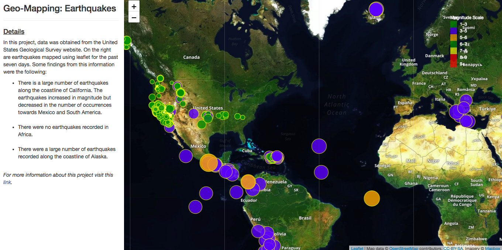

# geo-mapping

The United States Geological Survey provides earthquake data in a number of different formats, updated every 5 minutes. Visit the [USGS GeoJSON Feed](http://earthquake.usgs.gov/earthquakes/feed/v1.0/geojson.php) page and pick a data set to visualize. So, I decided to visualize this data on a geo-map using leaflet. This is the [GeoJSON endpoint](https://earthquake.usgs.gov/earthquakes/feed/v1.0/summary/all_week.geojson) I used for this project. Its the information for all earthquakes in the past week. 

You can explore the interactive map at this [link](https://bobbytaylor82.github.io/geo-mapping/).

Tools Used: 
<ul>
<li>HTML5 & CSS </li>
<li>JavaScript </li>
  
# Results 

